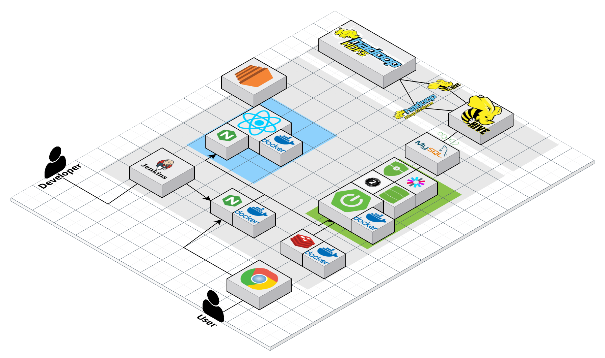
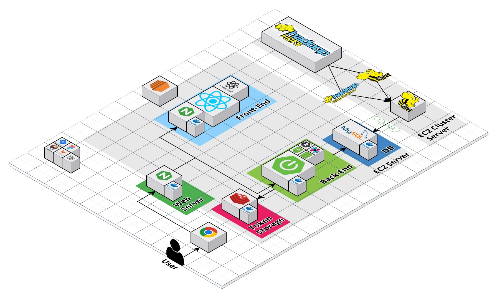

### 2023-03-03

데이터 셋 찾기 + 아이디어 찾기
- 보건,의료 데이터셋 사이트 ( 데이터 보여주는 여러 사이트 모아둔 곳 )

[보건의료빅데이터개방시스템](https://opendata.hira.or.kr/home.do)

- 인구 관련 통계 사이트 ( 엑셀로 다운로드해서 추출하는 형식 )

[KOSIS](https://kosis.kr/statHtml/statHtml.do?orgId=350&tblId=DT_35007_N130)


Figma 제작 (아이디어 폐기됨) <br>


- 판결문 AI 모델

[AI-Hub](https://aihub.or.kr/aihubdata/data/view.do?currMenu=115&topMenu=100&aihubDataSe=realm&dataSetSn=580)


- 법률 지식 베이스 AI 모델

[AI-Hub](https://aihub.or.kr/aihubdata/data/view.do?currMenu=115&topMenu=100&aihubDataSe=realm&dataSetSn=99)


Figma2 제작


## 2023-03-10
기능 명세서 추가 보완


## 2023-03-13

서버 보안 , 포트포워딩 설정

#### 1. ssh 설치
```java 
sudo apt-get update // apt-get 업데이트
sudo apt-get install openssh-server //ssh 설치
```

#### 2. /etc/ssh/sshd_config 설정
- sshd 관련 설정 파일
- pem key 파일 인증을 하기 위해 포트오픈 , Pubkey 설정 등 


#### 3. public key , private key 생성
```
ssh-keygen -t ed25519 -m PEM -f [만들 파일명]
```

타입을 rsa로 하면 접속시 __no mutual signature algorithm__ 에러 발생

이유는 rsa가 구식 보안 알고리즘이기 때문에 보안성이 약해서 못쓰게 함


#### 4. 생성된 대칭키를 알맞은 곳에 저장

Public Key는 서버의 홈 디렉터리에 .ssh 디렉터리에 authorized_keys 로 저장

Private key 는 사용자가 접속 인증할 때 사용할 것이기 떄문에 접속할 Client 에 저장


#### 5. 네트워크 포트포워딩

가상머신 -> 로컬 -> 외부 세번의 포트포워딩이 필요하기 떄문에 각각 규칙,설정

#### 6. 접속 확인
```
ssh -i [pem파일] [계정]@[도메인주소] 
```
로 접속 후 테스트


## 2023-03-14

- 아키텍처 설계도 작성 (추후 수정,정리 필요)


## 2023-03-15

- 중간발표용 아키텍처 설계도 작성 완료


## 2023-03-16

- 쿠버네티스 예제 작성 + 테스트
- 프로젝트 적용 여부 검토중..

#### front

```
apiVersion: apps/v1
kind: Deployment
metadata:
        name: test-front
spec:
        selector:
                matchLabels:
                        app: test-front
        replicas: 3
        template:
                 metadata:
                    labels:
                       app: test-front
                 spec:
                      containers:
                          - name : t-front
                            image: anhyogwan/matdoc:front5
                            imagePullPolicy : Always
                            ports:
                               - containerPort: 3000
                                 protocol: TCP
```
```
apiVersion: v1
kind: Service
metadata:
  name: test-front-service
spec:
  type: NodePort
  ports:
    - port: 80
      protocol: TCP
      targetPort: 3000
  selector:
    app: test-front
~                                                    
```


#### back

```
apiVersion: apps/v1
kind: Deployment
metadata:
        name: test-app
spec:
        selector:
                matchLabels:
                        app: test-application
        replicas: 3
        template:
                metadata:
                  labels:
                          app: test-application
                spec:
                        containers:
                                - name : core
                                  image : anhyogwan/matdoc:latest
                                  imagePullPolicy: Always
                                  ports:
                                          - containerPort: 8080
                                            protocol: TCP
```
```
apiVersion: v1
kind: Service
metadata:
  name: test-service
spec:
  type: ClusterIp
  ports:
    - port: 80
      protocol: TCP
      targetPort: 8080
  selector:
    app: test-application
```

### 2023-03-20

Ingress 파일 작성과 Ingress Controller 적용 및 외부 로드밸런서 테스트


__Ingress.yaml__
```
apiVersion: networking.k8s.io/v1
kind: Ingress
metadata:
        name: nginx-ingress
        namespace: ingress-nginx
        annotations:
                nginx.ingress.kubernetes.io/rewrite-target: /
                nginx.ingress.kubernetes.io/ssl-redirect: "false"
spec:
        rules:
              - host: j8b108.p.ssafy.io
                http:
                        paths:
                        - path: /
                          pathType: Prefix
                          backend:
                            service:
                                 name: test-front-service
                                 port:
                                    number: 80
        ingressClassName: nginx
```

Aws NLB(Network LoadBalancer를 불러와 Ingress의 외부 로드밸런서로 적용 시도 )
```
kubectl apply -f https://raw.githubusercontent.com/kubernetes/ingress-nginx/controller-v1.5.1/deploy/static/provider/aws/deploy.yaml
```
-> NLB가 External IP를 못가져와서 실패<br>
-> 못가져온 이유는 EKS가 아닌 kubeadm으로 설치가 되있기 떄문에 AWS에서의 클러스터 구축으로 인식을 못하므로 AWS에서 제공해주는 로드밸런서가 적용이 불가능하기 때문

AWS ALB(Application LoadBalancer)
-> 마찬가지로 실패<br>
-> NLB의 문제도 있고, ALB의 경우 IAM권한을 이용해 Role을 정해줘야 하는데 SSAFY에서 제공해주는 EC2의 특성 상 IAM권한 생성을 위한 AWS Console 접근이 불가능

### 결론
__방법 1. Ingress nginx Controller를 NodePort방식으로 사용__
- 현재 배포하고 있는 방식
- 단, 접속할때 80,443 포트이용이 불가능하고 30000~32xxx 번의 포트를 반드시 입력해 줘야 하기 때문에 포트포워딩이 필수
- 매우매우 마음에 안듬..

__방법 2. hostNetworrName=true 설정__
- 모든컨테이너들이 노드의 네트워크 namespace와 동일한 네트워크를 사용하게 만드는것
- 이 방법을 사용 할 시 원하는 형태의 주소는 사용이 가능하지만 파드의 IP 주소가 노출 될 우려가 있어 상당히 꺼려짐 (보안상으로 매우 안좋음)
- 정말 최후의 수단으로만 사용할법한 느낌

__방법 3. ALB,NLB 외의 다른 외부 로드밸런서 찾기__
- 현재 시도중인 방안 
- Bare Metal이나 oci 등의 외부 로드밸런서를 가지고와 배포를 하는 방식
- Private 환경 전용의 로드밸런서가 많기 때문에 과연 Public Cloud 환경인 EC2에서 정상적으로 작동 할 지가 미지수

__방법 4. Ingress를 사용하지 않고 배포하는 방식__
- 정확하게 알아보진 않음
- Ingress를 사용하지 않고 Service만 사용하여 배포하는 방식
- 서비스 IP가 노출되어 보안상 취약점이 생기고 확장성이 너무 구져짐
- 하지만 현재의 환경에선 그나마 제일 최신의 방법이 아닐까 생각은 하는중


그 외의 방법들을 찾아보고 뒤져보고 하는중

