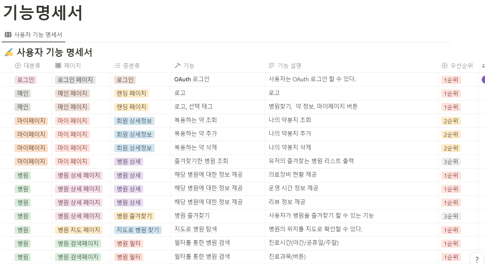
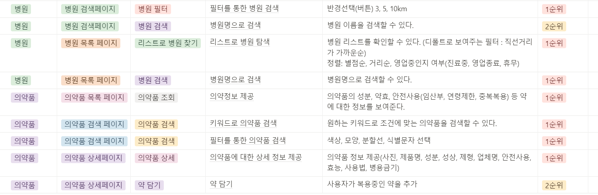

### 2023-03-03

데이터 셋 찾기 + 아이디어 찾기
- 보건,의료 데이터셋 사이트 ( 데이터 보여주는 여러 사이트 모아둔 곳 )

[보건의료빅데이터개방시스템](https://opendata.hira.or.kr/home.do)

- 인구 관련 통계 사이트 ( 엑셀로 다운로드해서 추출하는 형식 )

[KOSIS](https://kosis.kr/statHtml/statHtml.do?orgId=350&tblId=DT_35007_N130)


Figma 제작 (아이디어 폐기됨) <br>


- 판결문 AI 모델

[AI-Hub](https://aihub.or.kr/aihubdata/data/view.do?currMenu=115&topMenu=100&aihubDataSe=realm&dataSetSn=580)


- 법률 지식 베이스 AI 모델

[AI-Hub](https://aihub.or.kr/aihubdata/data/view.do?currMenu=115&topMenu=100&aihubDataSe=realm&dataSetSn=99)


Figma2 제작


## 2023-03-10
기능 명세서 추가 보완




## 2023-03-13

서버 보안 , 포트포워딩 설정

#### 1. ssh 설치
```java 
sudo apt-get update // apt-get 업데이트
sudo apt-get install openssh-server //ssh 설치
```

#### 2. /etc/ssh/sshd_config 설정
- sshd 관련 설정 파일
- pem key 파일 인증을 하기 위해 포트오픈 , Pubkey 설정 등 


#### 3. public key , private key 생성
```
ssh-keygen -t ed25519 -m PEM -f [만들 파일명]
```

타입을 rsa로 하면 접속시 __no mutual signature algorithm__ 에러 발생

이유는 rsa가 구식 보안 알고리즘이기 때문에 보안성이 약해서 못쓰게 함


#### 4. 생성된 대칭키를 알맞은 곳에 저장

Public Key는 서버의 홈 디렉터리에 .ssh 디렉터리에 authorized_keys 로 저장

Private key 는 사용자가 접속 인증할 때 사용할 것이기 떄문에 접속할 Client 에 저장


#### 5. 네트워크 포트포워딩

가상머신 -> 로컬 -> 외부 세번의 포트포워딩이 필요하기 떄문에 각각 규칙,설정

#### 6. 접속 확인
```
ssh -i [pem파일] [계정]@[도메인주소] 
```
로 접속 후 테스트
