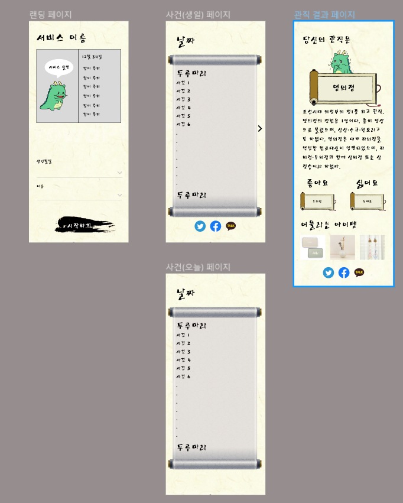

### 2023-03-03

데이터 셋 찾기 + 아이디어 찾기
- 보건,의료 데이터셋 사이트 ( 데이터 보여주는 여러 사이트 모아둔 곳 )

[보건의료빅데이터개방시스템](https://opendata.hira.or.kr/home.do)

- 인구 관련 통계 사이트 ( 엑셀로 다운로드해서 추출하는 형식 )

[KOSIS](https://kosis.kr/statHtml/statHtml.do?orgId=350&tblId=DT_35007_N130)

Figma 제작 (아이디어 폐기됨)  

- 판결문 AI 모델

[AI-Hub](https://aihub.or.kr/aihubdata/data/view.do?currMenu=115&topMenu=100&aihubDataSe=realm&dataSetSn=580)

- 법률 지식 베이스 AI 모델

[AI-Hub](https://aihub.or.kr/aihubdata/data/view.do?currMenu=115&topMenu=100&aihubDataSe=realm&dataSetSn=99)

Figma2 제작

push test 입니다