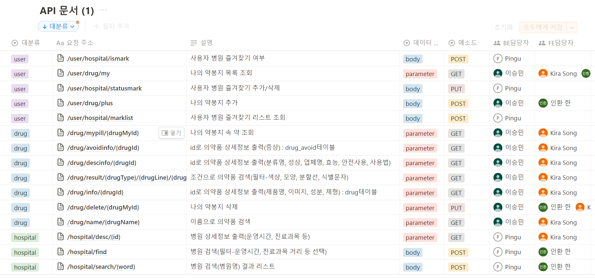

# API 명세서
 

## 명세서 상세보기
<details>
<summary>hospital API</summary>
<div markdown="1">

```JSON
{
	"info": {
		"_postman_id": "5ec7f15a-9794-4f3a-a8a8-cde0d016902f",
		"name": "hospital",
		"schema": "https://schema.getpostman.com/json/collection/v2.1.0/collection.json",
		"_exporter_id": "25115561"
	},
	"item": [
		{
			"name": "이름으로 병원찾기",
			"request": {
				"method": "POST",
				"header": [
					{
						"key": "Content-Type",
						"value": "text/plain;charset=UTF-8",
						"type": "text",
						"disabled": true
					},
					{
						"key": "",
						"value": "",
						"type": "text",
						"disabled": true
					}
				],
				"body": {
					"mode": "raw",
					"raw": "{\r\n    \"e\":127.35647601340733,\r\n    \"w\":127.29091439637051,\r\n    \"s\":36.34567675654588,\r\n    \"n\":36.35887261465578,\r\n    \"hour\":20,\r\n    \"min\": 40,\r\n    \"day\":1\r\n}",
					"options": {
						"raw": {
							"language": "json"
						}
					}
				},
				"url": {
					"raw": "http://localhost:8080/hospital/search/연세",
					"protocol": "http",
					"host": [
						"localhost"
					],
					"port": "8080",
					"path": [
						"hospital",
						"search",
						"연세"
					]
				}
			},
			"response": [
				{
					"status_code": 200,
					"message": "이름으로 병원찾기 검색 결과 리스트",
					"data": [
						{
							"hospitalId": 27688,
							"hospitalName": "유성연세의원",
							"hospitalOpen": true,
							"hospitalCode": "의원",
							"hospitalTel": "042-822-0456",
							"hospitalX": 127.3361996,
							"hospitalY": 36.3550182,
							"hospitalTime": {
								"hospital_time_id": 53,
								"hospital": {
									"hospital_id": 27688,
									"hospital_name": "유성연세의원",
									"hospital_code": "의원",
									"hospital_x": 127.3361996,
									"hospital_y": 36.3550182,
									"hospital_tel": "042-822-0456"
								},
								"hospitalTimeMon": "09:00~22:00",
								"hospitalTimeTue": "09:00~22:00",
								"hospitalTimeWed": "09:00~22:00",
								"hospitalTimeThu": "09:00~22:00",
								"hospitalTimeFri": "09:00~22:00",
								"hospitalTimeSat": "09:00~18:00",
								"hospitalTimeSun": "09:00~18:00",
								"hospitalTimeMonNight": 1,
								"hospitalTimeTueNight": 1,
								"hospitalTimeWedNight": 1,
								"hospitalTimeThuNight": 1,
								"hospitalTimeFriNight": 1,
								"hospitalTimeSatNight": 0,
								"hospitalTimeSunNight": 0,
								"hospitalTimeHoliday": 0,
								"hospitalTimeEtc": "장날에는 일요일 진료"
							},
							"hospitalPart": [
								"내과",
								"0",
								"소아청소년과",
								"0",
								"이비인후과",
								"0",
								"재활의학과",
								"0"
							]
						},
						{
							"hospitalId": 24583,
							"hospitalName": "연세엘레슈의원",
							"hospitalOpen": false,
							"hospitalCode": "의원",
							"hospitalTel": "042-471-6055",
							"hospitalX": 127.3424341,
							"hospitalY": 36.3537704,
							"hospitalTime": {
								"hospital_time_id": 43,
								"hospital": {
									"hospital_id": 24583,
									"hospital_name": "연세엘레슈의원",
									"hospital_code": "의원",
									"hospital_x": 127.3424341,
									"hospital_y": 36.3537704,
									"hospital_tel": "042-471-6055"
								},
								"hospitalTimeMon": "10:30~19:00",
								"hospitalTimeTue": "10:30~20:30",
								"hospitalTimeWed": "10:30~19:00",
								"hospitalTimeThu": "10:30~19:00",
								"hospitalTimeFri": "10:30~20:30",
								"hospitalTimeSat": "null",
								"hospitalTimeSun": "null",
								"hospitalTimeMonNight": 1,
								"hospitalTimeTueNight": 1,
								"hospitalTimeWedNight": 1,
								"hospitalTimeThuNight": 1,
								"hospitalTimeFriNight": 1,
								"hospitalTimeSatNight": 0,
								"hospitalTimeSunNight": 0,
								"hospitalTimeHoliday": 0,
								"hospitalTimeEtc": "null"
							},
							"hospitalPart": [
								"내과",
								"0",
								"성형외과",
								"0",
								"피부과",
								"0",
								"가정의학과",
								"1"
							]
						},
						{
							"hospitalId": 25217,
							"hospitalName": "연세화사외과의원",
							"hospitalOpen": false,
							"hospitalCode": "의원",
							"hospitalTel": "0507-1364-7580",
							"hospitalX": 127.3429741,
							"hospitalY": 36.3526651,
							"hospitalTime": {
								"hospital_time_id": 44,
								"hospital": {
									"hospital_id": 25217,
									"hospital_name": "연세화사외과의원",
									"hospital_code": "의원",
									"hospital_x": 127.3429741,
									"hospital_y": 36.3526651,
									"hospital_tel": "0507-1364-7580"
								},
								"hospitalTimeMon": "09:30~17:30",
								"hospitalTimeTue": "09:30~17:30",
								"hospitalTimeWed": "09:30~17:30",
								"hospitalTimeThu": "09:30~17:30",
								"hospitalTimeFri": "09:30~17:30",
								"hospitalTimeSat": "null",
								"hospitalTimeSun": "null",
								"hospitalTimeMonNight": 0,
								"hospitalTimeTueNight": 0,
								"hospitalTimeWedNight": 0,
								"hospitalTimeThuNight": 0,
								"hospitalTimeFriNight": 0,
								"hospitalTimeSatNight": 0,
								"hospitalTimeSunNight": 0,
								"hospitalTimeHoliday": 0,
								"hospitalTimeEtc": "null"
							},
							"hospitalPart": [
								"외과",
								"1",
								"성형외과",
								"0",
								"소아청소년과",
								"0",
								"피부과",
								"0",
								"가정의학과",
								"1"
							]
						},
						{
							"hospitalId": 1998,
							"hospitalName": "대전연세요양병원",
							"hospitalOpen": false,
							"hospitalCode": "요양병원",
							"hospitalTel": "042-826-2772",
							"hospitalX": 127.3508882,
							"hospitalY": 36.358794,
							"hospitalTime": {
								"hospital_time_id": 10,
								"hospital": {
									"hospital_id": 1998,
									"hospital_name": "대전연세요양병원",
									"hospital_code": "요양병원",
									"hospital_x": 127.3508882,
									"hospital_y": 36.358794,
									"hospital_tel": "042-826-2772"
								},
								"hospitalTimeMon": "09:00~18:30",
								"hospitalTimeTue": "09:00~18:30",
								"hospitalTimeWed": "09:00~18:30",
								"hospitalTimeThu": "09:00~18:30",
								"hospitalTimeFri": "09:00~18:30",
								"hospitalTimeSat": "null",
								"hospitalTimeSun": "null",
								"hospitalTimeMonNight": 1,
								"hospitalTimeTueNight": 1,
								"hospitalTimeWedNight": 1,
								"hospitalTimeThuNight": 1,
								"hospitalTimeFriNight": 1,
								"hospitalTimeSatNight": 0,
								"hospitalTimeSunNight": 0,
								"hospitalTimeHoliday": 0,
								"hospitalTimeEtc": "null"
							},
							"hospitalPart": [
								"내과",
								"0",
								"신경과",
								"0",
								"외과",
								"0",
								"정형외과",
								"0",
								"신경외과",
								"1",
								"재활의학과",
								"0",
								"가정의학과",
								"3",
								"한방내과",
								"0"
							]
						}
					]
				}
			]
		},
		{
			"name": "병원 상세보기",
			"request": {
				"method": "GET",
				"header": [],
				"url": {
					"raw": "http://localhost:8080/hospital/desc/799",
					"protocol": "http",
					"host": [
						"localhost"
					],
					"port": "8080",
					"path": [
						"hospital",
						"desc",
						"799"
					]
				}
			},
			"response": [
				{
					"status_code": 200,
					"message": "병원 상세보기",
					"data": {
						"hospitalId": 1,
						"hospitalAdd": "인천광역시 부평구 동수로 56 (부평동)",
						"hospitalParking": 920,
						"hospitalDevice": "CT/체외충격파쇄석기/MRI/양전자단층촬영기 (PET)/골밀도검사기/콘빔CT/초음파영상진단기/혈액투석을위한인공신장기/유방촬영장치",
						"hospitalSpecial": "제3차 의료급여기관/응급의료병원/성인·소아 중환자실/신생아 중환자실/가정간호실시병원/혈액투석/체외충격파쇄석술/인공와우이식술/완화의료전문기관"
					}
				}
			]
		},
		{
			"name": "병원 필터",
			"request": {
				"method": "POST",
				"header": [],
				"body": {
					"mode": "raw",
					"raw": "{\r\n    \"e\":127.3192741,\r\n    \"w\":127.2282741,\r\n    \"s\":36.4853737,\r\n    \"n\":36.598373699999996,\r\n    \"part\":[0],\r\n    \"open\":[0]\r\n}",
					"options": {
						"raw": {
							"language": "json"
						}
					}
				},
				"url": {
					"raw": "http://localhost:8080/hospital/find",
					"protocol": "http",
					"host": [
						"localhost"
					],
					"port": "8080",
					"path": [
						"hospital",
						"find"
					]
				}
			},
			"response": [
				{
					"status_code": 200,
					"message": "필터로 병원찾기 목록",
					"data": [
						{
							"hospitalId": 799,
							"hospitalName": "봉키병원",
							"hospitalCode": "병원",
							"hospitalTel": "1522-6705",
							"hospitalX": 127.3437349,
							"hospitalY": 36.3526462,
							"hospitalTime": {
								"hospital_time_id": 3,
								"hospital": {
									"hospital_id": 799,
									"hospital_name": "봉키병원",
									"hospital_code": "병원",
									"hospital_x": 127.3437349,
									"hospital_y": 36.3526462,
									"hospital_tel": "1522-6705"
								},
								"hospitalTimeMon": "08:00~23:00",
								"hospitalTimeTue": "08:00~23:00",
								"hospitalTimeWed": "08:00~23:00",
								"hospitalTimeThu": "08:00~23:00",
								"hospitalTimeFri": "08:00~23:00",
								"hospitalTimeSat": "09:00~20:00",
								"hospitalTimeSun": "09:00~20:00",
								"hospitalTimeMonNight": 1,
								"hospitalTimeTueNight": 1,
								"hospitalTimeWedNight": 1,
								"hospitalTimeThuNight": 1,
								"hospitalTimeFriNight": 1,
								"hospitalTimeSatNight": 1,
								"hospitalTimeSunNight": 1,
								"hospitalTimeHoliday": 0,
								"hospitalTimeEtc": "null"
							},
							"hospitalPart": [
								"내과",
								"0",
								"소아청소년과",
								"6",
								"안과",
								"0",
								"이비인후과",
								"0",
								"피부과",
								"0"
							]
						},
						{
							"hospitalId": 8917,
							"hospitalName": "다빈치마취통증의학과의원",
							"hospitalCode": "의원",
							"hospitalTel": "042-826-7689",
							"hospitalX": 127.334939,
							"hospitalY": 36.3579849,
							"hospitalTime": {
								"hospital_time_id": 19,
								"hospital": {
									"hospital_id": 8917,
									"hospital_name": "다빈치마취통증의학과의원",
									"hospital_code": "의원",
									"hospital_x": 127.334939,
									"hospital_y": 36.3579849,
									"hospital_tel": "042-826-7689"
								},
								"hospitalTimeMon": "08:45~17:00",
								"hospitalTimeTue": "08:45~17:00",
								"hospitalTimeWed": "08:45~13:00",
								"hospitalTimeThu": "08:45~17:00",
								"hospitalTimeFri": "08:45~17:00",
								"hospitalTimeSat": "00:00~00:05",
								"hospitalTimeSun": "00:00~00:05",
								"hospitalTimeMonNight": 0,
								"hospitalTimeTueNight": 0,
								"hospitalTimeWedNight": 0,
								"hospitalTimeThuNight": 0,
								"hospitalTimeFriNight": 0,
								"hospitalTimeSatNight": 0,
								"hospitalTimeSunNight": 0,
								"hospitalTimeHoliday": 0,
								"hospitalTimeEtc": "null"
							},
							"hospitalPart": [
								"내과",
								"0",
								"외과",
								"0",
								"정형외과",
								"0",
								"신경외과",
								"0",
								"마취통증의학과",
								"1",
								"소아청소년과",
								"0",
								"안과",
								"0",
								"이비인후과",
								"0",
								"피부과",
								"0",
								"비뇨의학과",
								"0",
								"재활의학과",
								"0"
							]
						},
						{
							"hospitalId": 27688,
							"hospitalName": "유성연세의원",
							"hospitalCode": "의원",
							"hospitalTel": "042-822-0456",
							"hospitalX": 127.3361996,
							"hospitalY": 36.3550182,
							"hospitalTime": {
								"hospital_time_id": 53,
								"hospital": {
									"hospital_id": 27688,
									"hospital_name": "유성연세의원",
									"hospital_code": "의원",
									"hospital_x": 127.3361996,
									"hospital_y": 36.3550182,
									"hospital_tel": "042-822-0456"
								},
								"hospitalTimeMon": "09:00~22:00",
								"hospitalTimeTue": "09:00~22:00",
								"hospitalTimeWed": "09:00~22:00",
								"hospitalTimeThu": "09:00~22:00",
								"hospitalTimeFri": "09:00~22:00",
								"hospitalTimeSat": "09:00~18:00",
								"hospitalTimeSun": "09:00~18:00",
								"hospitalTimeMonNight": 1,
								"hospitalTimeTueNight": 1,
								"hospitalTimeWedNight": 1,
								"hospitalTimeThuNight": 1,
								"hospitalTimeFriNight": 1,
								"hospitalTimeSatNight": 0,
								"hospitalTimeSunNight": 0,
								"hospitalTimeHoliday": 0,
								"hospitalTimeEtc": "null"
							},
							"hospitalPart": [
								"내과",
								"0",
								"소아청소년과",
								"0",
								"이비인후과",
								"0",
								"재활의학과",
								"0"
							]
						},
						{
							"hospitalId": 31967,
							"hospitalName": "좋아서하는의원",
							"hospitalCode": "의원",
							"hospitalTel": "042-710-8575",
							"hospitalX": 127.3433971,
							"hospitalY": 36.3575673,
							"hospitalTime": {
								"hospital_time_id": 60,
								"hospital": {
									"hospital_id": 31967,
									"hospital_name": "좋아서하는의원",
									"hospital_code": "의원",
									"hospital_x": 127.3433971,
									"hospital_y": 36.3575673,
									"hospital_tel": "042-710-8575"
								},
								"hospitalTimeMon": "10:00~21:00",
								"hospitalTimeTue": "14:00~21:00",
								"hospitalTimeWed": "10:00~21:00",
								"hospitalTimeThu": "10:00~21:00",
								"hospitalTimeFri": "10:00~21:00",
								"hospitalTimeSat": "10:00~18:00",
								"hospitalTimeSun": "10:00~18:00",
								"hospitalTimeMonNight": 1,
								"hospitalTimeTueNight": 1,
								"hospitalTimeWedNight": 1,
								"hospitalTimeThuNight": 1,
								"hospitalTimeFriNight": 1,
								"hospitalTimeSatNight": 0,
								"hospitalTimeSunNight": 0,
								"hospitalTimeHoliday": 0,
								"hospitalTimeEtc": "null"
							},
							"hospitalPart": [
								"내과",
								"0",
								"신경과",
								"0",
								"외과",
								"0",
								"정형외과",
								"0",
								"마취통증의학과",
								"0",
								"소아청소년과",
								"0",
								"안과",
								"0",
								"이비인후과",
								"0",
								"피부과",
								"0",
								"비뇨의학과",
								"0",
								"가정의학과",
								"1",
								"응급의학과",
								"0"
							]
						},
						{
							"hospitalId": 36610,
							"hospitalName": "한사랑의원",
							"hospitalCode": "의원",
							"hospitalTel": "044-867-3569",
							"hospitalX": 127.3388816,
							"hospitalY": 36.3500615,
							"hospitalTime": {
								"hospital_time_id": 72,
								"hospital": {
									"hospital_id": 36610,
									"hospital_name": "한사랑의원",
									"hospital_code": "의원",
									"hospital_x": 127.3388816,
									"hospital_y": 36.3500615,
									"hospital_tel": "044-867-3569"
								},
								"hospitalTimeMon": "09:00~22:00",
								"hospitalTimeTue": "09:00~22:00",
								"hospitalTimeWed": "09:00~22:00",
								"hospitalTimeThu": "09:00~22:00",
								"hospitalTimeFri": "09:00~22:00",
								"hospitalTimeSat": "09:00~18:30",
								"hospitalTimeSun": "09:00~18:30",
								"hospitalTimeMonNight": 1,
								"hospitalTimeTueNight": 1,
								"hospitalTimeWedNight": 1,
								"hospitalTimeThuNight": 1,
								"hospitalTimeFriNight": 1,
								"hospitalTimeSatNight": 1,
								"hospitalTimeSunNight": 1,
								"hospitalTimeHoliday": 0,
								"hospitalTimeEtc": "null"
							},
							"hospitalPart": [
								"내과",
								"0",
								"정형외과",
								"0",
								"소아청소년과",
								"0",
								"이비인후과",
								"0",
								"피부과",
								"0"
							]
						}
					]
				}
			]
		},
		{
			"name": "병원즐겨찾기 상태변경",
			"request": {
				"auth": {
					"type": "bearer",
					"bearer": [
						{
							"key": "token",
							"value": "eyJh",
							"type": "string"
						}
					]
				},
				"method": "PUT",
				"header": [],
				"body": {
					"mode": "raw",
					"raw": "{\r\n    \"userId\":1,\r\n    \"hospitalId\":10,\r\n    \"status\":true\r\n}",
					"options": {
						"raw": {
							"language": "json"
						}
					}
				},
				"url": {
					"raw": "http://localhost:8080/user/hospital/statusmark",
					"protocol": "http",
					"host": [
						"localhost"
					],
					"port": "8080",
					"path": [
						"user",
						"hospital",
						"statusmark"
					]
				}
			},
			"response": [
				{
					"status_code": 200,
					"message": "병원 즐겨찾기 신규 등록 완료",
					"data": true
				},
				{
					"status_code": 200,
					"message": "병원 즐겨찾기 등록 완료",
					"data": true
				},
				{
					"status_code": 200,
					"message": "병원 즐겨찾기 삭제 완료",
					"data": false
				}
			]
		},
		{
			"name": "병원즐겨찾기여부",
			"request": {
				"auth": {
					"type": "bearer",
					"bearer": [
						{
							"key": "token",
							"value": "eyJh",
							"type": "string"
						}
					]
				},
				"method": "POST",
				"header": [],
				"body": {
					"mode": "raw",
					"raw": "{\r\n    \"hospitalId\":5\r\n}",
					"options": {
						"raw": {
							"language": "json"
						}
					}
				},
				"url": {
					"raw": "http://localhost:8080/user/hospital/ismark",
					"protocol": "http",
					"host": [
						"localhost"
					],
					"port": "8080",
					"path": [
						"user",
						"hospital",
						"ismark"
					]
				}
			},
			"response": [
				{
					"status_code": 200,
					"message": "즐겨찾기한 병원입니다.",
					"data": true
				},
				{
					"status_code": 204,
					"message": "즐겨찾기한 병원이 아닙니다.",
					"data": false
				}
			]
		},
		{
			"name": "병원즐겨찾기 리스트",
			"protocolProfileBehavior": {
				"disabledSystemHeaders": {}
			},
			"request": {
				"auth": {
					"type": "bearer",
					"bearer": [
						{
							"key": "token",
							"value": "eyJh",
							"type": "string"
						}
					]
				},
				"method": "POST",
				"header": [],
				"body": {
					"mode": "raw",
					"raw": "{\r\n    \"hour\":9,\r\n    \"min\": 40,\r\n    \"day\":1\r\n}",
					"options": {
						"raw": {
							"language": "json"
						}
					}
				},
				"url": {
					"raw": "http://localhost:8080/user/hospital/marklist",
					"protocol": "http",
					"host": [
						"localhost"
					],
					"port": "8080",
					"path": [
						"user",
						"hospital",
						"marklist"
					]
				}
			},
			"response": [
				{
					"status_code": 200,
					"message": "즐겨찾기한 병원리스트",
					"data": [
						{
							"hospitalId": 3,
							"hospitalName": "강북삼성병원",
							"hospitalCode": "상급종합",
							"hospitalTel": "02-2001-2001",
							"hospitalX": 126.96775,
							"hospitalY": 37.5684083,
							"hospitalTime": null,
							"hospitalPart": [
								"내과",
								"58",
								"신경과",
								"7",
								"정신건강의학과",
								"7",
								"외과",
								"20",
								"정형외과",
								"10",
								"신경외과",
								"7",
								"심장혈관흉부외과",
								"4",
								"성형외과",
								"4",
								"마취통증의학과",
								"11",
								"산부인과",
								"7",
								"소아청소년과",
								"7",
								"안과",
								"6",
								"이비인후과",
								"7",
								"피부과",
								"3",
								"비뇨의학과",
								"6",
								"진단방사선과,영상의학과",
								"21",
								"방사선종양학과",
								"3",
								"병리과",
								"13",
								"진단검사의학과",
								"5",
								"재활의학과",
								"3",
								"핵의학과",
								"3",
								"가정의학과",
								"6",
								"응급의학과",
								"7",
								"직업환경의학과",
								"9",
								"구강악안면외과",
								"1",
								"치과보철과",
								"2",
								"치아교정과",
								"1",
								"치주과",
								"0",
								"치과보존과",
								"0"
							]
						},
						{
							"hospitalId": 2,
							"hospitalName": "강릉아산병원",
							"hospitalCode": "상급종합",
							"hospitalTel": "033-610-3114",
							"hospitalX": 128.8578411,
							"hospitalY": 37.8184325,
							"hospitalTime": null,
							"hospitalPart": [
								"내과",
								"41",
								"신경과",
								"5",
								"정신건강의학과",
								"2",
								"외과",
								"14",
								"정형외과",
								"8",
								"신경외과",
								"6",
								"심장혈관흉부외과",
								"6",
								"성형외과",
								"1",
								"마취통증의학과",
								"8",
								"산부인과",
								"7",
								"소아청소년과",
								"9",
								"안과",
								"4",
								"이비인후과",
								"6",
								"피부과",
								"1",
								"비뇨의학과",
								"5",
								"진단방사선과,영상의학과",
								"12",
								"방사선종양학과",
								"3",
								"병리과",
								"4",
								"진단검사의학과",
								"3",
								"재활의학과",
								"2",
								"핵의학과",
								"1",
								"가정의학과",
								"7",
								"응급의학과",
								"9",
								"구강악안면외과",
								"1",
								"치과보철과",
								"1"
							]
						},
						{
							"hospitalId": 1,
							"hospitalName": "가톨릭대학교인천성모병원",
							"hospitalCode": "상급종합",
							"hospitalTel": "032-1544-9004",
							"hospitalX": 126.7248987,
							"hospitalY": 37.4848309,
							"hospitalTime": null,
							"hospitalPart": [
								"내과",
								"58",
								"신경과",
								"6",
								"정신건강의학과",
								"4",
								"외과",
								"19",
								"정형외과",
								"11",
								"신경외과",
								"13",
								"심장혈관흉부외과",
								"5",
								"성형외과",
								"6",
								"마취통증의학과",
								"13",
								"산부인과",
								"6",
								"소아청소년과",
								"11",
								"안과",
								"6",
								"이비인후과",
								"5",
								"피부과",
								"4",
								"비뇨의학과",
								"5",
								"진단방사선과,영상의학과",
								"15",
								"방사선종양학과",
								"4",
								"병리과",
								"8",
								"진단검사의학과",
								"3",
								"재활의학과",
								"5",
								"핵의학과",
								"2",
								"가정의학과",
								"13",
								"응급의학과",
								"9",
								"치주과",
								"1",
								"한방내과",
								"0",
								"침구과",
								"0"
							]
						}
					]
				}
			]
		}
	]
}
```

</div>
</details>


<details>
<summary>drug API</summary>
<div markdown="1">

```JSON
{
	"info": {
		"_postman_id": "104f6c65-9354-4633-ac93-47d5e63d7530",
		"name": "drug",
		"schema": "https://schema.getpostman.com/json/collection/v2.1.0/collection.json",
		"_exporter_id": "25115561"
	},
	"item": [
		{
			"name": "이름으로 의약품 검색",
			"request": {
				"method": "GET",
				"header": [],
				"url": {
					"raw": "http://localhost:8080/drug/name/",
					"protocol": "http",
					"host": [
						"localhost"
					],
					"port": "8080",
					"path": [
						"drug",
						"name",
						""
					]
				}
			},
			"response": [
				{
					"status_code": 200,
					"message": "약 이름으로 검색 성공",
					"data": [
						{
							"drugId": 3,
							"drugName": "아네모정",
							"drugImg": "d145s62oycon3s.cloudfront.net/3.png",
							"drugMarkf": "SJΛ",
							"drugMarkb": "-",
							"drugType": "원형",
							"drugColorf": "하양",
							"drugColorb": "-",
							"drugLine": "oxo",
							"drugIngre": "건조수산화알루미늄겔|탄산수소나트륨|침강탄산칼슘|탄산마그네슘|스코폴리아엑스10배산"
						}
					]
				}
			]
		},
		{
			"name": "외형으로 의약품 찾기",
			"request": {
				"method": "GET",
				"header": [],
				"url": {
					"raw": "http://localhost:8080/drug/result/타원형/a/하양/-",
					"protocol": "http",
					"host": [
						"localhost"
					],
					"port": "8080",
					"path": [
						"drug",
						"result",
						"타원형",
						"a",
						"하양",
						"-"
					]
				}
			},
			"response": [
				{
					"status_code": 200,
					"message": "약 조건으로 검색 성공",
					"data": [
						{
							"drugId": 20790,
							"drugName": "메가텔디핀정80/5밀리그램",
							"drugImg": "d145s62oycon3s.cloudfront.net/20790.png",
							"drugMarkf": "마크12",
							"drugMarkb": "-",
							"drugType": "타원형",
							"drugColorf": "하양",
							"drugColorb": "회색",
							"drugLine": "oxo",
							"drugIngre": "null"
						},
						{
							"drugId": 20708,
							"drugName": "텔미듀얼정40/10밀리그램",
							"drugImg": "d145s62oycon3s.cloudfront.net/20708.png",
							"drugMarkf": "LP2",
							"drugMarkb": "-",
							"drugType": "타원형",
							"drugColorf": "하양",
							"drugColorb": "회색",
							"drugLine": "oxo",
							"drugIngre": "null"
						},
						{
							"drugId": 20707,
							"drugName": "텔미듀얼정80/5밀리그램",
							"drugImg": "d145s62oycon3s.cloudfront.net/20707.png",
							"drugMarkf": "LP3",
							"drugMarkb": "-",
							"drugType": "타원형",
							"drugColorf": "하양",
							"drugColorb": "회색",
							"drugLine": "oxo",
							"drugIngre": "null"
						},
						{
							"drugId": 20662,
							"drugName": "텔미듀얼정40/5밀리그램",
							"drugImg": "d145s62oycon3s.cloudfront.net/20662.png",
							"drugMarkf": "LP1",
							"drugMarkb": "-",
							"drugType": "타원형",
							"drugColorf": "하양",
							"drugColorb": "회색",
							"drugLine": "oxo",
							"drugIngre": "null"
						}
					]
				}
			]
		},
		{
			"name": "의약품 상세정보(제품명, 이미지,성분,제형)",
			"request": {
				"method": "GET",
				"header": [],
				"url": {
					"raw": "http://localhost:8080/drug/info/6000",
					"protocol": "http",
					"host": [
						"localhost"
					],
					"port": "8080",
					"path": [
						"drug",
						"info",
						"6000"
					]
				}
			},
			"response": [
				{
					"status_code": 200,
					"message": "약 검색 성공",
					"data": {
						"drugId": 6000,
						"drugName": "엘프연질캡슐",
						"drugImg": "d145s62oycon3s.cloudfront.net/6000.png",
						"drugMarkf": "YJELF",
						"drugMarkb": "-",
						"drugType": "장방형",
						"drugColorf": "갈색",
						"drugColorb": "-",
						"drugLine": "oxo",
						"drugIngre": "null"
					}
				}
			]
		},
		{
			"name": "의약품 상세정보 (분류명, 성상, 업체, 효능, 안전사용, 사용법)",
			"request": {
				"method": "GET",
				"header": [],
				"url": {
					"raw": "http://localhost:8080/drug/descinfo/6000",
					"protocol": "http",
					"host": [
						"localhost"
					],
					"port": "8080",
					"path": [
						"drug",
						"descinfo",
						"6000"
					]
				}
			},
			"response": [
				{
					"status_code": 200,
					"message": "약 상세정보 검색 성공",
					"data": {
						"drugId": 1,
						"drugDescCat": "주로그람양성|음성균|리케치아|비루스에작용하는것",
						"drugDescShape": "이약은백색내지황백색의결정또는결정성가루가들어있는상의는갈색|하의는미황색의캅셀이다.",
						"drugDescCom": "(주)종근당",
						"drugDescSafety": "null",
						"drugDescEffect": "null",
						"drugDescUse": "null"
					}
				}
			]
		},
		{
			"name": "의약품 상세보기(병용금기)",
			"request": {
				"method": "GET",
				"header": [],
				"url": {
					"raw": "http://localhost:8080/drug/avoidinfo/4",
					"protocol": "http",
					"host": [
						"localhost"
					],
					"port": "8080",
					"path": [
						"drug",
						"avoidinfo",
						"4"
					]
				}
			},
			"response": [
				{
					"status_code": 200,
					"message": "약 검색 성공",
					"data": [
						{
							"drugAvoidId": 1,
							"drugId": 4,
							"drugAvoidB": 8882,
							"drugAvoidNameB": "네오티가손캡슐10밀리그램(아시트레틴)",
							"drugAvoidDesc": "두개내압 증가"
						},
						{
							"drugAvoidId": 2,
							"drugId": 4,
							"drugAvoidB": 2064,
							"drugAvoidNameB": "아키놀연질캡슐(이소트레티노인)",
							"drugAvoidDesc": "테트라사이클린 가성뇌종양 보고"
						},
						{
							"drugAvoidId": 3,
							"drugId": 4,
							"drugAvoidB": 2120,
							"drugAvoidNameB": "니메겐연질캡슐(이소트레티노인)",
							"drugAvoidDesc": "테트라사이클린 가성뇌종양 보고"
						},
						{
							"drugAvoidId": 4,
							"drugId": 4,
							"drugAvoidB": 3196,
							"drugAvoidNameB": "뉴티논연질캡슐(이소트레티노인)",
							"drugAvoidDesc": "테트라사이클린 가성뇌종양 보고"
						},
						{
							"drugAvoidId": 5,
							"drugId": 4,
							"drugAvoidB": 3387,
							"drugAvoidNameB": "이소트렌연질캡슐(이소트레티노인)",
							"drugAvoidDesc": "테트라사이클린 가성뇌종양 보고"
						},
						{
							"drugAvoidId": 6,
							"drugId": 4,
							"drugAvoidB": 3622,
							"drugAvoidNameB": "트레틴연질캡슐10mg(이소트레티노인)",
							"drugAvoidDesc": "테트라사이클린 가성뇌종양 보고"
						},
						{
							"drugAvoidId": 7,
							"drugId": 4,
							"drugAvoidB": 4345,
							"drugAvoidNameB": "이소티논연질캡슐10밀리그램(이소트레티노인)",
							"drugAvoidDesc": "테트라사이클린 가성뇌종양 보고"
						},
						{
							"drugAvoidId": 8,
							"drugId": 4,
							"drugAvoidB": 4704,
							"drugAvoidNameB": "레씨범연질캡슐(이소트레티노인)",
							"drugAvoidDesc": "테트라사이클린 가성뇌종양 보고"
						},
						{
							"drugAvoidId": 9,
							"drugId": 4,
							"drugAvoidB": 4881,
							"drugAvoidNameB": "트레인연질캡슐(이소트레티노인)",
							"drugAvoidDesc": "테트라사이클린 가성뇌종양 보고"
						},
						{
							"drugAvoidId": 10,
							"drugId": 4,
							"drugAvoidB": 8262,
							"drugAvoidNameB": "트레논연질캡슐(이소트레티노인)",
							"drugAvoidDesc": "테트라사이클린 가성뇌종양 보고"
						},
						{
							"drugAvoidId": 11,
							"drugId": 4,
							"drugAvoidB": 14395,
							"drugAvoidNameB": "로이탄연질캡슐(이소트레티노인)",
							"drugAvoidDesc": "테트라사이클린 가성뇌종양 보고"
						},
						{
							"drugAvoidId": 12,
							"drugId": 4,
							"drugAvoidB": 15607,
							"drugAvoidNameB": "오피큐탄연질캡슐(이소트레티노인)",
							"drugAvoidDesc": "테트라사이클린 가성뇌종양 보고"
						},
						{
							"drugAvoidId": 13,
							"drugId": 4,
							"drugAvoidB": 15790,
							"drugAvoidNameB": "이소탐연질캡슐(이소트레티노인)",
							"drugAvoidDesc": "테트라사이클린 가성뇌종양 보고"
						},
						{
							"drugAvoidId": 14,
							"drugId": 4,
							"drugAvoidB": 16077,
							"drugAvoidNameB": "우리큐탄연질캡슐(이소트레티노인)",
							"drugAvoidDesc": "테트라사이클린 가성뇌종양 보고"
						},
						{
							"drugAvoidId": 15,
							"drugId": 4,
							"drugAvoidB": 16503,
							"drugAvoidNameB": "로아크연질캡슐(이소트레티노인)",
							"drugAvoidDesc": "테트라사이클린 가성뇌종양 보고"
						}
					]
				}
			]
		},
		{
			"name": "'나의 약봉지' 속 약 조회",
			"request": {
				"auth": {
					"type": "bearer",
					"bearer": [
						{
							"key": "token",
							"value": "eyJh",
							"type": "string"
						}
					]
				},
				"method": "GET",
				"header": [],
				"url": {
					"raw": "http://localhost:8080/drug/mypill/1",
					"protocol": "http",
					"host": [
						"localhost"
					],
					"port": "8080",
					"path": [
						"drug",
						"mypill",
						"1"
					]
				}
			},
			"response": [
				{
					"status_code": 200,
					"message": "나의 약봉지 속 약 출력 성공",
					"data": [
						{
							"drugMyPillId": 1,
							"drugId": {
								"drug_id": 1,
								"drug_name": "헤로세친캅셀250밀리그람(클로람페니콜)",
								"drug_img": "d145s62oycon3s.cloudfront.net/1.png",
								"drug_markf": "CKD250",
								"drug_markb": "-",
								"drug_type": "장방형",
								"drug_colorf": "갈색",
								"drug_colorb": "노랑",
								"drug_line": "oxo",
								"drug_ingre": "null"
							},
							"drugMyId": 1
						},
						{
							"drugMyPillId": 2,
							"drugId": {
								"drug_id": 3,
								"drug_name": "아네모정",
								"drug_img": "d145s62oycon3s.cloudfront.net/3.png",
								"drug_markf": "SJΛ",
								"drug_markb": "-",
								"drug_type": "원형",
								"drug_colorf": "하양",
								"drug_colorb": "-",
								"drug_line": "oxo",
								"drug_ingre": "건조수산화알루미늄겔|탄산수소나트륨|침강탄산칼슘|탄산마그네슘|스코폴리아엑스10배산"
							},
							"drugMyId": 1
						}
					]
				}
			]
		},
		{
			"name": "'나의 약봉지' 삭제",
			"request": {
				"auth": {
					"type": "bearer",
					"bearer": [
						{
							"key": "token",
							"value": "eyJh",
							"type": "string"
						}
					]
				},
				"method": "PUT",
				"header": [],
				"url": {
					"raw": "http://localhost:8080/drug/delete/1",
					"protocol": "http",
					"host": [
						"localhost"
					],
					"port": "8080",
					"path": [
						"drug",
						"delete",
						"1"
					]
				}
			},
			"response": [
				{
					"status_code": 200,
					"message": "나의 약봉지 삭제 성공",
					"data": 1
				}
			]
		},
		{
			"name": "'나의 약봉지' 목록 조회",
			"request": {
				"method": "GET",
				"header": [],
				"url": {
					"raw": "http://localhost:8080/user/drug/my",
					"protocol": "http",
					"host": [
						"localhost"
					],
					"port": "8080",
					"path": [
						"user",
						"drug",
						"my"
					]
				}
			},
			"response": [
				{
					"status_code": 200,
					"message": "나의 약봉지 목록 출력 성공",
					"data": [
						{
							"drugMyId": 1,
							"drugMyDel": false,
							"drugMyMemo": "memo",
							"drugMyTitle": "title",
							"userId": 1
						},
						{
							"drugMyId": 2,
							"drugMyDel": false,
							"drugMyMemo": "hello",
							"drugMyTitle": "제목2",
							"userId": 1
						}
					]
				}
			]
		},
		{
			"name": "'나의 약봉지' 추가",
			"request": {
				"method": "POST",
				"header": [],
				"body": {
					"mode": "raw",
					"raw": "{\r\n    \"drugId\" : [1, 2, 3],\r\n    \"drugMyMemo\" : \"String\",\r\n    \"drugMyTitle\" : \"String\"\r\n\r\n}",
					"options": {
						"raw": {
							"language": "json"
						}
					}
				},
				"url": {
					"raw": "http://localhost:8080/user/drug/my",
					"protocol": "http",
					"host": [
						"localhost"
					],
					"port": "8080",
					"path": [
						"user",
						"drug",
						"my"
					]
				}
			},
			"response": [
				{
					"drugMyId": 1,
					"drugMyDel": false,
					"drugMyMemo": "String",
					"drugMyTitle": "String",
					"userId": 3
				}
			]
		}
	]
}

```

</div>
</details>