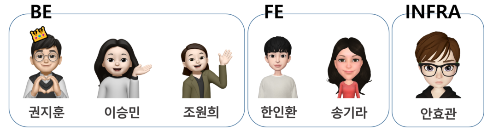

# 맞닥_당신만의 맞춤 의사 

## 🩺 서비스 설명- 아플 때 언제까지 지도 보고 있을래?

병원을 고르는 일은 항상 어렵습니다. 내가 원하는 진료방법을 사용하는지, 의사는 친절한지, 너무 비싸지는 않은지… 그래서 수소문을 하게 됩니다. 병원에 전화를 해보고 동네 커뮤니티에 질문을 올리고  아는 사람에게 물어보고... 이런 번거롭고 귀찮은 과정은 
<mark>
**맞닥**
</mark>에게 맡겨주세요. 

◆ <mark>증상에 따른 병원을 추천해드립니다</mark> : 퇴근 후 병원을 가야하는 직장인, 새벽에 갑자기 아픈 아이, 마음은 급한데 어느 병원이 열었는지 하나하나 지도에서 눌러보고 계셨나요? 사용자가 증상을 입력하면 현재 운영하고 있는 병원과 약국을 리뷰, 거리 순으로 추천해줍니다. 당연히 감기에 정형외과를 추천해 드리지는 않죠!

◆ <mark>신뢰성있는 병원정보를 제공합니다</mark> : 전국 병의원 및 약국 현황,  해당 병원에서 가지고 있는 의료장비 현황, 의료인력 정보,  특수진료병원 정보, 병원 수가, 병원평가등급, 운영 시간, 사용자 리뷰까지. 하나부터 열까지 다 알려드립니다. 

◆ <mark>의약품 정보를 제공합니다</mark> : 처방받은 약, 어떤 약인지 알고 드세요! ****진통제라고 다 같은 효과가 아니라는 것을 알고 계신가요? 이부프로펜 계열의 진통제는 소염증상에 사용되고, 아세트아미노펜 계열의 진통제는 진통증상에 사용됩니다. 이렇게나 다양하고 다른 의약품들의 정보를 낱낱히 알려드립니다.

◆ <mark>복용한 약을 관리할 수 있습니다</mark> : 먹고있는 영양제와 비타민부터 장기복용하는 약까지. 어떤 약을 먹고있는지 알고있는 것은 중요합니다.  특히 영유아를 둔 보호자라면 아이가 어떤 약을 먹었는지 기록하여 확인할 수 있습니다. 

 
<aside>

 
✅ 한 눈에 들어오는 메디컬 케어 서비스. 맞닥 입니다.
 
</aside>
 

## 📣 기능

### 👩‍⚕️ 병원정보 제공👩‍⚕️

- 건강보험심사평가원에 등록되어 있는 병의원, 약국의 정보를 보여준다.
    - 병의원, 약국의 시설정보, 운영시간, 리뷰 등을 크롤링 하여 전처리 후 DB에 저장한다.
    

### 🩹 증상에 따른 병원 추천🩹

- 사용자가 입력한 증상을 토대로 병원 정보를 추천해준다.
    - 진료과목, 전문의, 위치 등을 고려한 병원을 보여준다.
    - 운영시간, 리뷰, 거리 등으로 정렬하여 보여준다.
- 유저의 즐겨찾는 병원을 등록해서 쉽게 찾아 볼 수 있게 해준다.

### 👩‍🔬 의약정보 제공👩‍🔬

- 의약품의 성분, 약효, 안전사용(임산부, 연령제한, 중복복용) 등 약에 대한 정보를 보여준다.

### 💊 복용중인 약 관리💊

- 사용자가 약의 이름과 복용기간을 등록하면, 약의 성분, 용량 등을 기록할 수 있다.

### 👨‍👩‍👧‍👦 회원

- 회원가입을 통해 사용자 맞춤 서비스를 이용할 수 있도록 한다.

 

## 👩‍💻 TEAM 앞구르기

---

