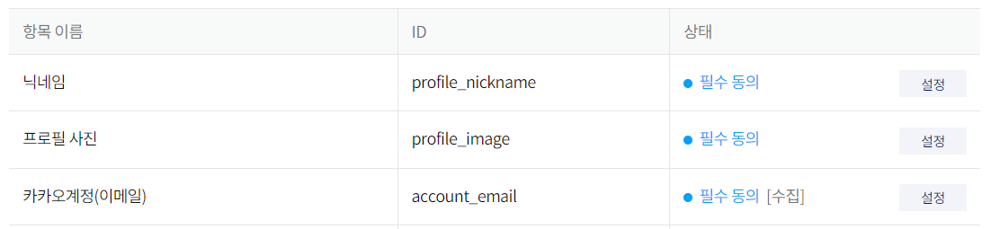
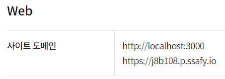

# 포팅 매뉴얼

### 외부 서비스 정보

### Kakao API : [https://developers.kakao.com/](https://developers.kakao.com/)

## 서버

### Web Server : NginX Web Server

### 이미지 서버 : AWS S3

## DB

- **MySql Workbench : 8.0.32**
- **MyISAM**

# Version

- **Front - End**

| Node.js | 16.19.0 |
| --- | --- |
| React | 18.2.0 |
| VS Code | 1.77.1 |
| Create-react-app | 5.0.1 |
| React-dom | 18.2.0 |
| React-router-dom | 6.4 |
| React-kakao-maps-sdk | 1.1.8 |
| axios | 1.3.4 |
| npm | 8.19.3 |
| prop-types | 15.8.1 |
| recoil | 0.7.7 |
| recoil-persist | 4.2.0 |
| CSS | styled-component - v5.3.9 |
| geolocation | 0.2.0 |
| Lodash | 4.17.21 |

- **Back - End**

- springBoot

| IntelliJ | 2021.2.4 |
| --- | --- |
| JDK | 11.0.13 |
| SpringBoot | 2.7.9 |
| dependency | 1.0.15 |
| gradle | 8.0 |
| jwt | 0.9.1 |
| lombok | 118.26 |
| JPA | 2.7.9 |
| QueryDsl | 5.0.0 |
| Postman | 10.2 |

- HDFS

| VMware | 17.0.1 |
| --- | --- |
| ubuntu | 22.04.2 |
| hadoop | 3.3.4 |
| Hive | 3.1.2 |
| MySql | Workbench 8 |
| Sqoop | 1.4.7 |

# DB 접속 정보

| Type | MySQL 8.0.32 |
| --- | --- |
| Host | https://j8b108.p.ssafy.io/doc |
| Username | matdoc |
| Password | matdoc111!@ |
| Database | matdoc |
| Port | 3306 |

| Type | Redis 5.0.7 |
| --- | --- |
| Host | https://j8b108.p.ssafy.io/doc |
| Password | matdocredis158!@ |
| Database | matdoc |
| Port | 6380 |

# Kakao Dev 설정

### 개인정보 동의 항목



### 내 애플리케이션 > 앱 설정 > 플랫폼



### Redirect URI


# EC2 개발 환경

---

### Ubuntu 운영체제

version : 20.04 LTS

310 GB

### Docker

version : 23.0.1

### Docker Compose

version : 1.25.0

### NginX(EC2)

version : 1.18.0

### k8s

version : 1.26.3

### Ansible

version : 2.9.6

### SonarQube

version : 8.9.9

### Helm

version : 3.11.2

## Docker

---

### Jenkins (container)

version : ****2.387.1****

- 0.0.0.0 : 9001→8080

### Nginx & React (container)

- 0.0.0.0 : 3000→80

### SpringBoot (container)

- 0.0.0.0 : 8080→8080

## k8s

---

### ArgoCD

version : 2.6.7

### Grafana

version : 9.3.8

### NginX(k8s)

version : 1.18.0


<details>
<summary> 배포과정 </summary>
<div markdown="1">
# 배포 과정
---
마스터노드 설치를 위한 스왑파일 비활성화

```jsx
sudo swapoff -a 
sudo sed -i '/ swap / s/^\(.*\)$/#\1/g' /etc/fstab
```

Docker설치, 활성화

```jsx
sudo yum install -y yum-utils
sudo yum-config-manager \
    --add-repo \
    https://download.docker.com/linux/centos/docker-ce.repo
sudo yum install docker-ce docker-ce-cli containerd.io -y
sudo service docker start
sudo chkconfig docker on
```

Front Dockerfile 작성

```jsx
FROM nginx

# root 에 app 폴더를 생성
RUN mkdir /app

# work dir 고정
WORKDIR /app

# work dir 에 build 폴더 생성 /app/build
RUN mkdir ./build

# host pc의 현재경로의 build 폴더를 workdir 의 build 폴더로 복사
ADD ./build ./build

# host pc 의 nginx.conf 를 아래 경로에 복사
COPY ./nginx.conf /etc/nginx/conf.d

# container 실행 시 자동으로 실행할 command. nginx 시작함
CMD ["nginx", "-g", "daemon off;"]
```

Back Dockerfile 작성

```jsx
FROM openjdk:11-jdk
COPY *.jar app.jar
ENTRYPOINT ["java","-jar","app.jar"]
```

kubeadm 설정파일,레포추가

```jsx
cat <<EOF > /etc/sysctl.d/k8s.conf
net.bridge.bridge-nf-call-ip6tables = 1
net.bridge.bridge-nf-call-iptables = 1
EOF
sysctl --system

cat <<EOF > /etc/yum.repos.d/kubernetes.repo
[kubernetes]
name=Kubernetes
baseurl=https://packages.cloud.google.com/yum/repos/kubernetes-el7-\$basearch
enabled=1
gpgcheck=1
repo_gpgcheck=1
gpgkey=https://packages.cloud.google.com/yum/doc/yum-key.gpg https://packages.cloud.google.com/yum/doc/rpm-package-key.gpg
exclude=kubelet kubeadm kubectl
EOF

```

kubelet,kubectl,kubeadm 설치

```jsx
sudo yum install -y kubelet kubeadm kubectl --disableexcludes=kubernetes
systemctl enable --now kubelet
```

클러스터 초기화,및 cidr 설정

```jsx
sudo kubeadm init
```

마스터노드 taint 삭제

```jsx
kubectl taint nodes --all node-role.kubernetes.io/control-plane- node-role.kubernetes.io/master-
kubectl get nodes
```

jenkins용 docker-compose.yml 파일 작성

```jsx
version: "3"
services:
  jenkins_back:
    image: jenkins/jenkins:lts
    user: root
    volumes:
      - ./jenkins:/var/jenkins_home_back
    ports:
      - 9002:8080
  jenkins_front:
    image: jenkins/jenkins:lts
    user: root
    volumes:
      - ./jenkins:/var/jenkins_home_front
    ports:
      - 9001:8080
```

jenkins 시작

```jsx
sudo docker-compose up -d
```

nginx(EC2) 설정

```jsx
server {
  listen 80;
  access_log /var/log/nginx/http.access.log;
  server_name [Server];

  location / {
    return 301 [Server];
  }

}

  server {
  listen 443 ssl http2;
  access_log /var/log/nginx/https.access.log;

  server_name [Server];

 ssl_certificate [Certification_path]
 ssl_certificate_key [Certification_private_path]

location / {
  proxy_pass [Server]:[Port];
}
}
```

nginx ingress controller 설치 및 적용

```jsx
kubectl apply -f https://raw.githubusercontent.com/kubernetes-sigs/aws-load-balancer-controller/v2.4.7/docs/examples/2048/2048_full.yaml
```

백, 프론트 Ingress Manifest파일 작성

```jsx
apiVersion: networking.k8s.io/v1
kind: Ingress
metadata:
  name: front-ingress2
  annotations:
    ingress.kubernetes.io/ssl-redirect: "true"
    kubernetes.io/ingress.class: nginx
    kubernetes.io/tls-acme: "true"
    cert-manager.io/cluster-issuer: letsencrypt-issuer
spec:
  tls:
    secretName: web-devbox-kr-cert
  rules:
    http:
      paths:
      - path: /
        pathType: Prefix
        backend:
          service:
            name: front-service
            port:
              number: 80
        host: "[Domain]"
```

Service Manifest 파일 작성

```jsx
apiVersion: v1
kind: Service
metadata:
  name: back-service
spec:
  type: ClusterIP
  ports:
    - port: 80
      protocol: TCP
      targetPort: 8080
  selector:
    app: Spring-server
---
apiVersion: v1
kind: Service
metadata:
  name: front-service
spec:
  type: ClusterIP
  ports:
    - port: 80
      protocol: TCP
      targetPort: 3000
  selector:
    app: react-application
```

Back,Front Pod Manifest 작성

```jsx
apiVersion: networking.k8s.io/v1
kind: Ingress
metadata:
  name: front-ingress2
  annotations:
    ingress.kubernetes.io/ssl-redirect: "true"
    kubernetes.io/ingress.class: nginx
    kubernetes.io/tls-acme: "true"
    cert-manager.io/cluster-issuer: letsencrypt-issuer
spec:
  tls:
    secretName: web-devbox-kr-cert
  rules:
    http:
      paths:
      - path: /
        pathType: Prefix
        backend:
          service:
            name: front-service
            port:
              number: 80
        host: "[Domain]"
```

### Helm

---

```jsx
curl https://baltocdn.com/helm/signing.asc | sudo apt-key add -
sudo apt-get install apt-transport-https --yes
echo "deb https://baltocdn.com/helm/stable/debian/ all main" | sudo tee /etc/apt/sources.list.d/helm-stable-debian.list
sudo apt-get update
sudo apt-get install helm
```

### ArgoCD

---

ArgoCD설치

```jsx
kubectl create namespace argo
helm repo update
helm fetch argo/argo-cd
tar -xvzf argo-cd-3.6.4.tgz
cd argo-cd
vim values.yaml
helm install argo -n argo argo/argo-cd -f values.yaml
```

초기 비밀번호 획득

```jsx
kubectl -n argo get secret argocd-initial-admin-secret -o jsonpath="{.data.password}" | base64 -d
```

### Grafana + Prometheus

---

Grafana+Prometheus 설치

```jsx
kubectl create namespace monitoring
helm repo add prometheus-community https://prometheus-community.github.io/helm-charts
helm repo update
helm install prometheus prometheus-community/kube-prometheus-stack --namespace monitoring
```

### **Ansible**

---

Ansible 설치

```jsx
sudo apt install ansible
```

BackPlaybook.yaml 작성

```jsx
  hosts: ec2
#   become: true

  # create docker images
  tasks:

    name: create a BackImages with deployed jar file
    command: sudo docker build ./jar -f Dockerfile-back -t [repo]/[image_name]-[version]
    tags:
      - release-be

    name: push the Back image on Docker Hub
    command: sudo docker push [repo]/[image_name]-[version]
    ignore_error: yes
    tags:
      - release-be

 hosts: ec2
#   become: true

  # create docker images
  tasks:
# remove images
    name: remove the config image from the ansible server
    command: sudo docker rmi [repo]/[image_name]-[version]
    ignore_error: yes
    tags:
      - release-be
```

FrontPlaybook.yaml 작성

```jsx
 hosts: ec2
#   become: true

  # create docker images
  tasks:

    name: create a FrontImages with deployed
    command: sudo docker build [Build_Path] -f Dockerfile-front -t [repo]/[image_name]-[version]
    tags:
      - release-fe

    name: push the Front image on Docker Hub
    command: sudo docker push [repo]/[image_name]-[version]
    ignore_error: yes
    tags:
      - release-fe

  hosts: ec2
#   become: true

  # create docker images
  tasks:
# remove images
    name: remove the config image from the ansible server
    command: sudo docker rmi [repo]/[image_name]-[version]
    ignore_error: yes
    tags:
      - release-fe
```

### ****HorizontalPodAutoscaler****

---

hpa 설정

```jsx
apiVersion: autoscaling/v2
kind: HorizontalPodAutoscaler
metadata:
  name: Spring-hpa
spec:
  minReplicas: 2
  maxReplicas: 10

  metrics:
  - type: Resource
    resource:
      name: cpu
      target:
        averageUtilization: 10
        type: Utilization

  scaleTargetRef:
    apiVersion: apps/v1
    kind: Deployment
    name: spring-app
```

Jenkins 파이프라인
```jsx
pipeline{
    agent none
    options{
        timestamps()
        gitLabConnection()
    }
    
    stages{
        stage("Build"){
            steps{
                node('matdoc-Front'){
                    build (
                        job : "POD-CI-Pipeline-AWS-Front",
                        parameters: [
                            string(name:"prebuild",value:"${previousBuild.number}"),
                            string(name:"curbuild",value:"${currentBuild.number}")
                            ]
                    )
                }
            }
        }
        
         stage("Deploy"){
             steps{
                 node('matdoc-Front'){
                    build (
                        job : "POD-CD-Pipeline-AWS-Front",
                        parameters: [
                            string(name:"prebuild",value:"${previousBuild.number}"),
                            string(name:"curbuild",value:"${currentBuild.number}")
                            ]
                    )
                 }
             }
         }
    }
    
    
    
}


pipeline{
    agent{
        label 'matdoc-Front'
    }
    
    parameters{
        string(name: "prebuild")
        string(name: "curbuild")
    }
    
    stages{
        stage('GitLab Clone'){
            steps{
                git branch: "dev-fe", credentialsId:''",url:""
                sh "chmod +x -R"
            }
        }
        
        stage('SonarQube analysis'){
            parallel{
                stage('Front Server Analysis'){
                            dir("front"){
                                sh '''
                                ${SonarQube}/bin/sonar-scanner -Dsonar.projectKey=matdocfront -Dsonar.host.url= -Dsonar.login=
                                '''
                     }
            }
        }
        
        
        stage("Build"){
            steps{
                dir('front'){
                    sh 'npm install'
                    sh 'npm run build'
                }
            }
        }

        stage("Remove Docker Images"){
            steps{
                sshPublisher(publishers: [
                    sshPublisherDesc(
                        transfers: [
                            sshTransfer(
                                cleanRemote: false, 
                                excludes: '', 
                                execCommand: "", 
                                execTimeout: 300000, 
                                flatten: false, 
                                makeEmptyDirs: false, 
                                noDefaultExcludes: false, 
                                remoteDirectory: '.', 
                                remoteDirectorySDF: false, 
                                removePrefix: '', 
                                sourceFiles: ''
                                )], 
                                usePromotionTimestamp: false, 
                                useWorkspaceInPromotion: false, 
                                verbose: false)])
            }
        }
        stage("Push Docker Images"){
            steps{
                echo "${prebuild} , ${curbuild}"
                sshPublisher(publishers: [
                    sshPublisherDesc(
                        transfers: [
                            sshTransfer(cleanRemote: false,excludes: '', execTimeout: 300000, flatten: false, makeEmptyDirs: false, noDefaultExcludes: false, 
                                remoteDirectory: ".", 
                                remoteDirectorySDF: false, 
                                removePrefix: "", 
                                sourceFiles: ""
                                )], 
                                usePromotionTimestamp: false, 
                                useWorkspaceInPromotion: false, 
                                verbose: false)])
            }
        
    }
    
}


pipeline{
    agent{
        label none
    }
    parameters{
        string(name: "prebuild")
        string(name: "curbuild")
    }

    stages{
       stage('K8S Manifest Update') {
            post {
                    failure {
                      echo 'K8S Manifest Update failure !'
                    }
                    success {
                      echo 'K8S Manifest Update success !'
                    }
            }
        }
    }
}


pipeline{
    agent none
    options{
        timestamps()
        gitLabConnection()
    }
    
    stages{
        stage("Build"){
            steps{
                node('matdoc-Back'){
                    build (
                        job : "POD-CI-Pipeline-AWS-Back",
                        parameters: [
                            string(name:"prebuild",value:"${previousBuild.number}"),
                            string(name:"curbuild",value:"${currentBuild.number}")
                            ])
                  )
             }
        }
        
         stage("Deploy"){
             steps{
                 node('matdoc-Back'){
                    build (
                        job : "POD-CD-Pipeline-AWS-Back",
                        parameters: [
                            string(name:"prebuild",value:"${previousBuild.number}"),
                            string(name:"curbuild",value:"${currentBuild.number}")
                            ]
                  )
             }
         }
    }


pipeline{
    agent{
        label none
    }
    tools{
        gradle 'gradle-7.6'
    }
    parameters{
        string(name: "prebuild")
        string(name: "curbuild")
    }
    
    stages{
        stage('GitLab Clone'){
            steps{
                git branch: "release-be", credentialsId:'',url:'"
                sh 'chmod +x -R ${env.WORKSPACE}'
            }
        }
        
        stage('SonarQube analysis'){
            parallel{
                stage('Server Analysis'){
                    steps{
                            dir('back'){
                                    sh '''
                                        gradle init
                                        chmod +x gradlew
                                        ./gradlew sonarqube -Dsonar.projectKey=matdocback -Dsonar.host.url= -Dsonar.login=
                                    '''
                        }
                 }
            }
        }
        
        stage("Build"){
            steps{
                dir('back'){
                    sh"./gradlew clean build --exclude-task test -Pprofile=prod"
                }
            }
        }
        stage("Remove Docker Images"){
            steps{
                sshPublisher(publishers: [
                    sshPublisherDesc(
                        transfers: [
                            sshTransfer(
                                cleanRemote: false, 
                                excludes: '', 
                                execTimeout: 300000, 
                                flatten: false, 
                                makeEmptyDirs: false, 
                                noDefaultExcludes: false, 
                                remoteDirectory: ".", 
                                remoteDirectorySDF: false, 
                                removePrefix: "", 
                                sourceFile: ""
                                )], 
                                usePromotionTimestamp: false, 
                                useWorkspaceInPromotion: false, 
                                verbose: false)])
            }
        }
        stage("Push Docker Images"){
            steps{
                echo "${prebuild} , ${curbuild}"
                sshPublisher(publishers: [
                    sshPublisherDesc(
                        transfers: [
                            sshTransfer(
                                cleanRemote: false,
                                excludes: "",   
                                execTimeout: 300000, 
                                flatten: false, 
                                makeEmptyDirs: false, 
                                noDefaultExcludes: false, 
                                remoteDirectory: ".", 
                                remoteDirectorySDF: false, 
                                removePrefix: "", 
                                sourceFile: ""
                                )], 
                                usePromotionTimestamp: false, 
                                useWorkspaceInPromotion: false, 
                                verbose: false)])
            }
        
    }
    
}


pipeline{
    agent{
        label none
    }
    tools{
        gradle 'gradle-7.6'
    }
    parameters{
        string(name: "prebuild")
        string(name: "curbuild")
    }
            post {
                    failure {
                      echo 'K8S Manifest Update failure !'
                    }
                    success {
                      echo 'K8S Manifest Update success !'
                    }
            }
        }
    }
}
```
</div>
</details>

